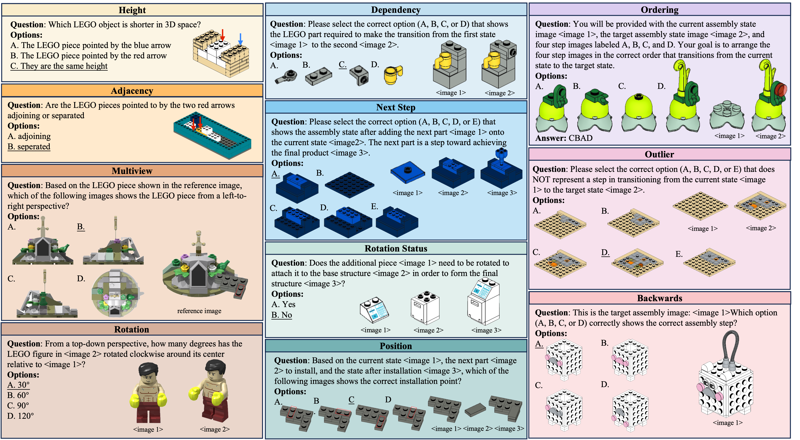
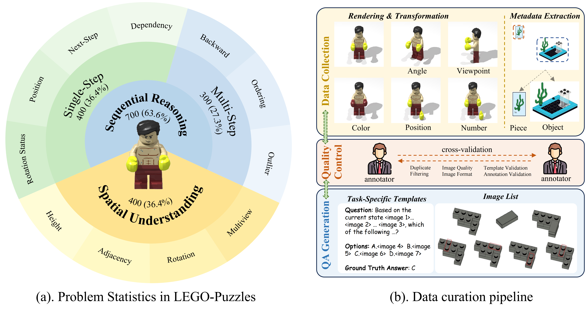
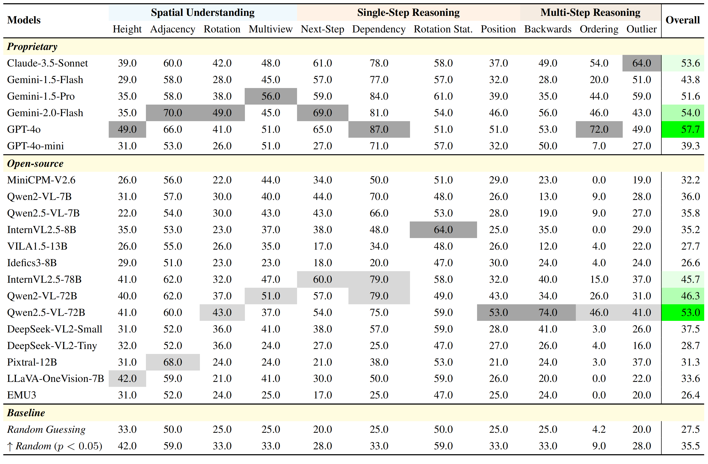
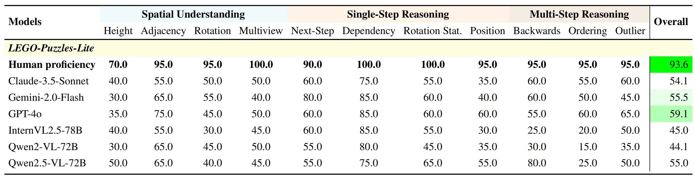
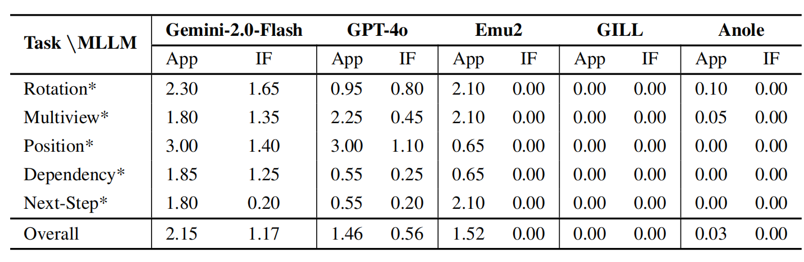
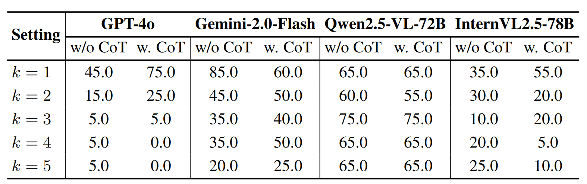
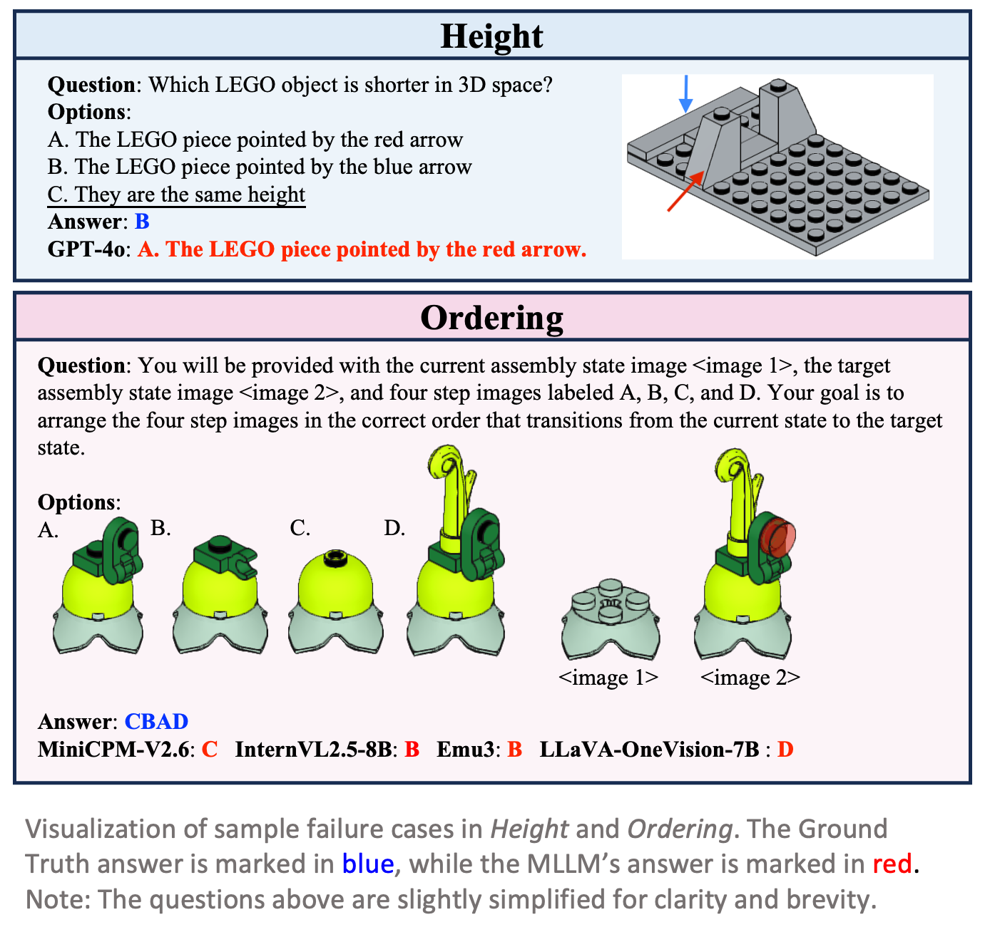
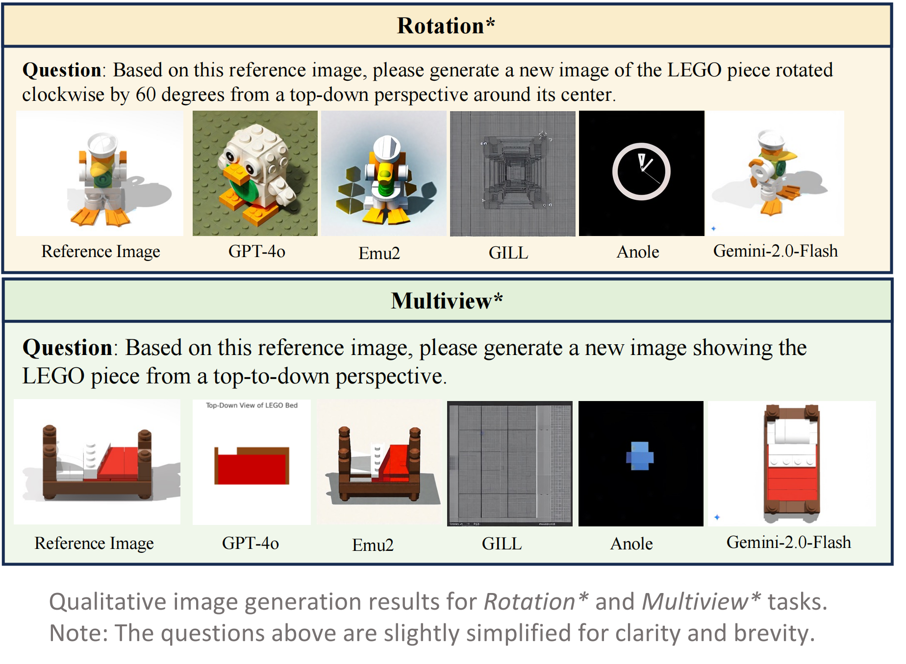

<div align="center">

# LEGO-Puzzles: How Good Are MLLMs at Multi-Step Spatial Reasoning?

[Kexian Tang](https://scholar.google.com/citations?user=cXjomd8AAAAJ&hl=zh-CN&oi=ao)<sup>1,2\*</sup>,
[Junyao Gao](https://jeoyal.github.io/home/)<sup>1,2\*</sup>,
[Yanhong Zeng](https://zengyh1900.github.io)<sup>1†</sup>,
[Haodong Duan](https://kennymckormick.github.io/)<sup>1†</sup>,

[Yanan Sun](https://scholar.google.com/citations?user=6TA1oPkAAAAJ&hl=zh-CN&oi=ao)<sup>1</sup>,
[Zhening Xing](https://scholar.google.com/citations?hl=zh-CN&user=sVYO0GYAAAAJ)<sup>1</sup>,
[Wenran Liu](https://scholar.google.com/citations?hl=zh-CN&user=fwKOaD8AAAAJ)<sup>1</sup>,
[Kaifeng Lyu](https://kaifeng.ac/cn/)<sup>3‡</sup>,
[Kai Chen](https://chenkai.site/)<sup>1‡</sup>

<sub><sup>1</sup>Shanghai AI Laboratory <sup>2</sup>Tongji University <sup>3</sup>Simons Institute, UC Berkeley</sub>  
<sub><sup>\*</sup>Equal contribution. <sup>†</sup>Project Leads. <sup>‡</sup>Corresponding Authors.</sub>  


<p align="center">
  <a href='https://tangkexian.github.io/LEGO-Puzzles/'>
    
  </a>
  <a href='https://arxiv.org/abs/2503.19990'>
    
  </a>
  <a href='https://opencompass.openxlab.space/utils/VLMEval/LEGO.tsv'>
    
  </a>


</p>
</div>
<div align="center">
  
</div>

## 🎉 News
- **\[2025/04/08\]** The benchmark and evaluation code have been released! Have fun 😃 .
- **\[2025/03/25\]** The paper is released.

## 📖 Introduction

In this work, we introduce **LEGO-Puzzles**, a scalable and systematic benchmark designed to evaluate Multi-step Spatial Reasoning in Multimodal Large Language Models (MLLMs). Inspired by how humans develop spatial cognition through construction, LEGO-Puzzles frames spatial understanding as a series of LEGO assembly tasks that challenge both visual perception and sequential reasoning.

To comprehensively assess spatial reasoning capabilities, LEGO-Puzzles is structured into three core task categories: **Spatial Understanding**, **Single-Step Sequential Reasoning**, and **Multi-Step Sequential Reasoning**. Each task requires models to understand visual inputs, perform step-by-step logical deduction, and maintain spatial consistency across sequences.

In addition to traditional Visual Question Answering (VQA), LEGO-Puzzles also incorporates **image generation tasks**, assessing whether MLLMs can visually simulate structural transformations and anticipate future assembly states.

We further introduce **LEGO-Puzzles-Lite**, a distilled subset tailored for human-model comparison, and a fine-grained evaluation suite named **Next-k-Step** to test reasoning scalability under increasing complexity.

Despite recent advances in multimodal modeling, our experiments reveal that current state-of-the-art MLLMs—while impressive—fall significantly short of human-level spatial reasoning, especially in multi-step and generative tasks.

**LEGO-Puzzles aims to establish a rigorous testbed for benchmarking spatial reasoning in MLLMs and to motivate the development of more spatially-aware multimodal systems.**

## 🔍 Dataset & Task Design

LEGO-Puzzles consists of **1,100 curated samples across 11 task types**, evenly covering:
- 🧩 **Spatial Understanding** (36.4%)  
- 🔁 **Single-Step Sequential Reasoning** (36.4%)  
- 🧠 **Multi-Step Sequential Reasoning** (27.3%)

Each task is framed as a visual question-answering problem or a generation prompt grounded in realistic LEGO configurations, enabling precise and interpretable evaluation.

<div align="center">
  
</div>

## 🧪 Main Evaluation Results

We evaluate **20 cutting-edge MLLMs**, spanning both open-source and proprietary models. While GPT-4o and Gemini-2.0-Flash lead overall, their performance still trails behind human annotators, especially in tasks requiring 3D spatial alignment, rotation handling, and multi-step assembly tracking.

<div align="center">
  
</div>

## 👤 Human vs Model Performance

To highlight the human-model performance gap, we compare top MLLMs against human annotators on **LEGO-Puzzles-Lite** (220 samples). Humans consistently outperform MLLMs by a wide margin, reaffirming the challenges of spatial reasoning in current AI systems.

<div align="center">
  
</div>

## 🎨 Image Generation Evaluation

We design **5 LEGO-based image generation tasks** testing a model's ability to simulate spatial transformations. Models must generate intermediate assembly states based on instructions. Human evaluators assess the output across two axes:
- 🎯 **Appearance Similarity**
- 🎯 **Instruction Following**

Only **Gemini-2.0-Flash** and **GPT-4o** show partial success. Open-source models typically fail to produce structurally valid or instruction-aligned images.

<div align="center">
  
</div>

## 🧠 Multi-Step Reasoning with Next-k-Step

We propose **Next-k-Step**, a fine-grained reasoning benchmark that challenges models to predict assembly states after *k* sequential steps. We analyze model performance under varying values of *k*, both with and without **Chain-of-Thought (CoT)** prompting. Results suggest CoT does not robustly enhance multi-step spatial reasoning.

<div align="center">
  
</div>

## 🧷 Qualitative Samples

A few representative examples from LEGO-Puzzles are shown below, illustrating the diversity and complexity of the benchmark.

<div align="center">
  
  
</div>


## 🛠️ Quick Start

We have fully integrated **LEGO-Puzzles** into [VLMEvalKit](https://github.com/open-compass/VLMEvalKit), a unified framework for benchmarking VLMs. You can easily evaluate your favorite multimodal models on LEGO-Puzzles with just a single command!

### Step 0. Installation

```bash
git clone https://github.com/open-compass/VLMEvalKit.git
cd VLMEvalKit
pip install -e .
```
### Step 1. Setup API Keys (Optional)
If you want to evaluate API-based models like GPT-4o, Gemini-Pro-V, etc., or use a LLM judge, configure the required keys in a .env file or export them as environment variables:

```bash
# Example .env (place it in VLMEvalKit root directory)
OPENAI_API_KEY=your-openai-key
GOOGLE_API_KEY=your-google-api-key
# ...other optional keys
```
If no key is provided, VLMEvalKit defaults to exact-match scoring (only works for Yes/No or multiple-choice tasks).

### Step 2. Run Evaluation on LEGO-Puzzles

You can now run LEGO-Puzzles by simply setting the dataset name to `LEGO`.

**Inference + Evaluation**
```bash
python run.py --data LEGO --model <your_model_name> --verbose
# Example:
# python run.py --data LEGO --model idefics_80b_instruct --verbose
```
**Inference Only**
```bash
python run.py --data LEGO --model <your_model_name> --verbose --mode infer
# Example:
# python run.py --data LEGO --model idefics_80b_instruct --verbose --mode infer
```
**Multi-GPU Acceleration (Optional)**
```bash
torchrun --nproc-per-node=4 run.py --data LEGO --model <your_model_name> --verbose
# Example:
# torchrun --nproc-per-node=4 run.py --data LEGO --model idefics_80b_instruct --verbose
```


## Citation
If you find LEGO-Puzzles useful, please cite using this BibTeX:
```bibtex
@article{tang2025lego,
    title={LEGO-Puzzles: How Good Are MLLMs at Multi-Step Spatial Reasoning?},
    author={Tang, Kexian and Gao, Junyao and Zeng, Yanhong and Duan, Haodong and Sun, Yanan and Xing, Zhening and Liu,
    Wenran and Lyu, Kaifeng and Chen, Kai},
    journal={arXiv preprint arXiv:2503.19990},
    year={2025}
}
```
